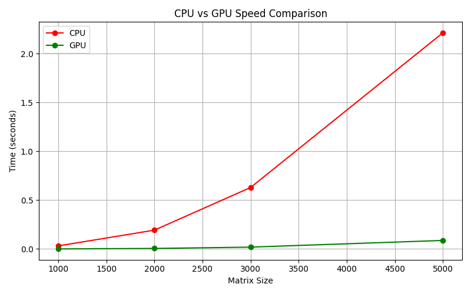
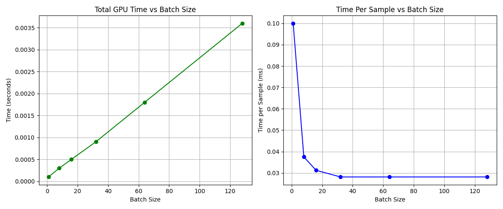
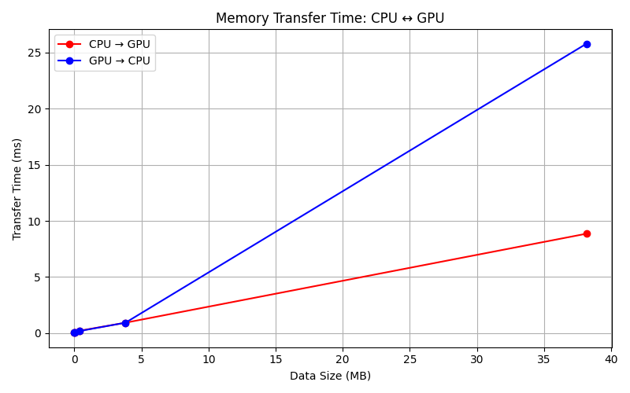
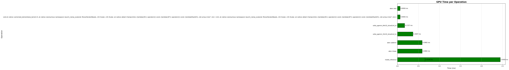
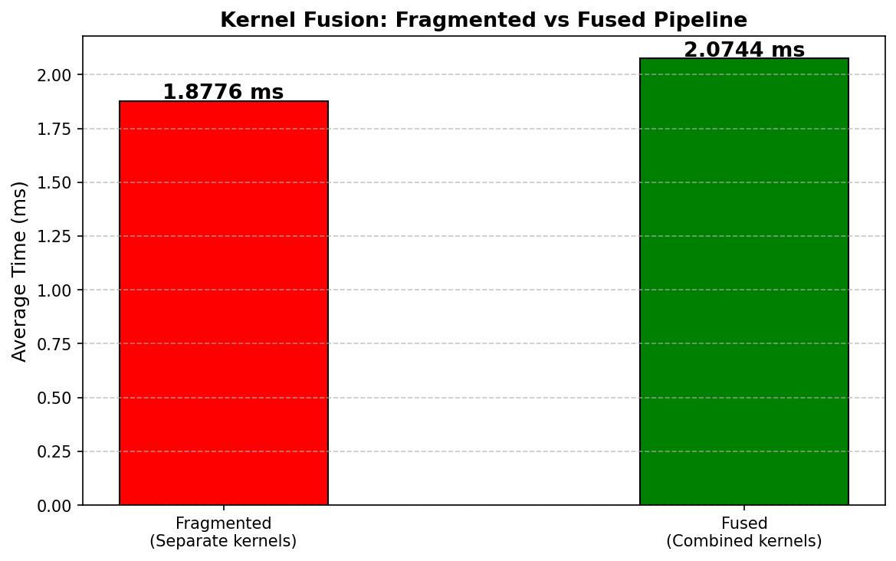
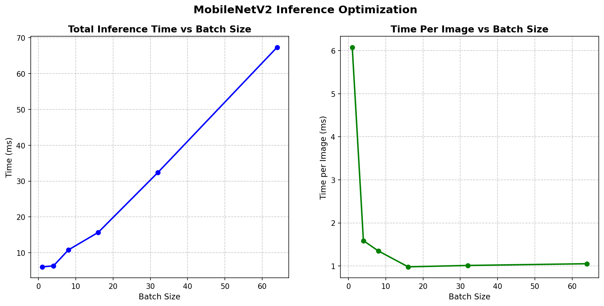

# GPU-Aware AI Inference Optimization

## Overview

This repository documents a hands-on exploration of GPU computing
and hardware-aware performance optimization for AI inference
workloads. Starting from the most fundamental question of how CPU
and GPU differ in handling tensor computation, each experiment
progressively builds intuition around GPU execution, memory
behavior, and inference optimization from first principles.

The core question driving this work:

> What actually happens when an AI model runs on hardware,
> and how can we make it run more efficiently?

---

## Motivation

Most machine learning practitioners interact with GPUs through
high-level frameworks without understanding the underlying
execution model. This project was built to close that gap,
beginning with basic tensor operations and moving toward
profiling, memory analysis, kernel behavior, and real
computer vision inference optimization.

This is a self-directed learning initiative to build
hardware-aware intuition that goes beyond model building
toward understanding the systems that make AI efficient at scale.

---

## Experiments

### 1. CPU vs GPU Execution Speed

Benchmarked matrix multiplication across increasing sizes
on both CPU and GPU using PyTorch. Measured execution time
with proper GPU synchronization for accurate timing.

| Matrix Size | CPU Time (s) | GPU Time (s) |
|-------------|-------------|-------------|
| 1000x1000   | 0.0185      | 0.001       |
| 2000x2000   | 0.1298      | 0.006       |
| 3000x3000   | 0.4539      | 0.0194      |
| 5000x5000   | 3.5225      | 0.0881      |

**Key Finding:**
At 5000x5000 matrix size, GPU was 40x faster than CPU.
As computation size grows, GPU advantage becomes
significantly larger while CPU time grows steeply.

---

### 2. Batch Size Impact on Inference Throughput

Tested inference speed across different batch sizes to
understand how GPU utilization changes with workload size.

| Batch Size | GPU Time (s) | Time Per Sample (ms) |
|------------|-------------|---------------------|
| 1          | 0.0001      | 0.375               |
| 128        | 0.0036      | 0.0281              |

**Key Finding:**
Larger batch sizes are significantly more efficient per sample.
Batch size 128 was 13x more efficient per sample than batch
size 1, demonstrating that GPU parallel processing is better
utilized with larger workloads.

---

### 3. CPU to GPU Memory Transfer Analysis

Measured data transfer time between CPU and GPU memory
across different data sizes to understand memory transfer
overhead in AI inference pipelines.

| Data Size (MB) | CPU to GPU (ms) | GPU to CPU (ms) |
|----------------|----------------|----------------|
| 0.0038         | 0.0429         | 0.0486         |
| 0.0381         | 0.0482         | 0.0443         |
| 0.3815         | 0.2179         | 0.1938         |
| 3.8147         | 0.9365         | 0.9382         |
| 38.147         | 8.8553         | 25.7597        |

**Key Finding:**
Memory transfer time grows proportionally with data size.
GPU to CPU transfer becomes significantly slower at large
sizes, with 38MB taking 25.76ms to transfer back to CPU.
Minimizing unnecessary data movement between CPU and GPU
is critical for inference performance. Best practice is
to move data to GPU once and keep it there as long as
possible.

---

### 4. PyTorch Profiler Analysis

Used PyTorch Profiler to analyze operation level execution
time inside a neural network, identifying which layers
consume the most GPU time.
Self CPU time total:  98.759ms
Self CUDA time total: 72.768us

**Key Finding:**
CPU time significantly exceeded CUDA time, revealing CPU
overhead as the primary bottleneck. The addmm operation
combining matrix multiply and bias addition consumed the
most GPU time, confirming that linear layers are the
heaviest operations in fully connected networks.

---

### 5. Kernel Fusion Intuition

Explored the concept of kernel fusion by comparing
fragmented and fused execution pipelines using
torch.addmm() to combine Linear and Bias operations
into a single GPU kernel launch.

| Execution Type | Average Time (ms) |
|---------------|------------------|
| Fragmented    | 1.8776           |
| Fused         | 2.0744           |

**Profiler Results:**
Fragmented - Self CPU time total:  25.774ms
Fused      - Self CPU time total:  22.773ms
Self CUDA time total: 18.095ms

**Key Finding:**
Modern PyTorch automatically optimizes many simple
operations internally, making timing differences small
at this scale. However the profiler clearly shows the
fused version produced measurable CUDA activity while
the fragmented version showed no CUDA time recorded,
demonstrating how PyTorch handles these operations
differently at the kernel level. The core principle
remains important: reducing kernel launches reduces
overhead and minimizes unnecessary memory movement.
Real benefits become significant at production scale
with complex model architectures.

---

### 6. Computer Vision Inference Optimization

Loaded a pretrained MobileNetV2 model and measured
inference performance across different batch sizes,
applying all previous learnings to a real computer
vision workload.

**Inference Throughput by Batch Size:**

| Batch Size | Total Time (ms) | Per Image (ms) |
|------------|----------------|---------------|
| 1          | 6.0781         | 6.0781        |
| 4          | 6.3476         | 1.5869        |
| 8          | 10.7924        | 1.3491        |
| 16         | 15.6803        | 0.9800        |
| 32         | 32.3759        | 1.0117        |
| 64         | 67.3210        | 1.0519        |

**Profiler Results:**
Self CPU time total:  193.300ms
Self CUDA time total: 158.745ms

**Top GPU consumers:**
- Convolution layers: 92.153ms (58% of CUDA time)
- Depthwise convolution: 41.284ms (26% of CUDA time)
- Batch normalization: 36.910ms (23% of CUDA time)

**Key Finding:**
Batch size 16 achieved the best per image efficiency
at 0.98ms per image. Convolution layers dominated GPU
time, consuming over 80% of total CUDA execution time
in MobileNetV2. Combining model.eval() and
torch.no_grad() significantly reduces memory usage
and computation overhead during inference.

---

## Key Concepts Explored

- CPU vs GPU execution models and parallel processing
- Tensor device management in PyTorch
- GPU synchronization for accurate timing
- Batch size impact on GPU utilization and throughput
- Memory transfer overhead between CPU and GPU
- PyTorch Profiler for identifying performance bottlenecks
- Kernel fusion and reducing kernel launch overhead
- Real computer vision inference optimization

---

## Technical Stack

- **Language:** Python
- **Framework:** PyTorch, TorchVision
- **Environment:** Google Colab (NVIDIA T4 GPU)
- **Visualization:** Matplotlib
- **Version Control:** GitHub

---

## How to Run

1. Open notebook in Google Colab
2. Set runtime to GPU:
   Runtime → Change runtime type → GPU → T4
3. Run cells sequentially
4. Charts are saved automatically in Colab files panel

---

## About

I am Tejaswi Dasari, an MS Computer Science student
with a strong interest in AI systems, machine learning
engineering, and hardware-aware optimization. This
repository is part of my ongoing effort to build deep
technical foundations in GPU computing and inference
optimization, going beyond model building toward
understanding the systems that make AI efficient at scale.
